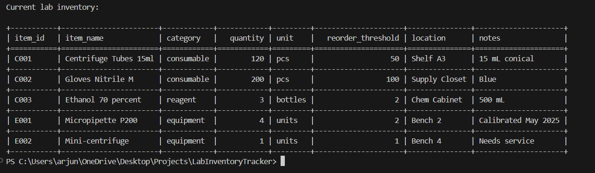

# 🧪 Lab Inventory Tracker (SQLite + Python)

This is a command-line inventory tracker I built to manage lab stock efficiently. It uses a local SQLite database (`inventory.db`) and lets you:

- Track and view current lab items
- Apply usage logs (e.g., experiment consumption)
- Auto-generate a restock list
- Keep everything clean with `pandas` + `tabulate`

No web UI — just clean, readable CLI and local data handling.

---

## 🔧 Features

- 📦 View lab inventory in a grid-style table
- 📉 Apply usage logs to update quantities
- 📋 Generate `restock_list.csv` for items below threshold
- 🧠 Simple, no-nonsense CLI (`argparse`)
- 🗂️ Local storage using SQLite (no server needed)

---

## ⚙️ Setup

1. Install dependencies:

```bash
pip install pandas tabulate
```

2. Run the setup script to initialize the database:

```bash
python setup.py
```

This will:

- Create the `Inventory` and `UsageLog` tables
- Load data from `inventory.csv` and `usage_log.csv` (if present)
- Save everything into `inventory.db`

---

## 💻 Usage

```bash
python inventory_tracker.py status
python inventory_tracker.py apply-usage
python inventory_tracker.py restock
```

| Command        | What it does                                         |
|----------------|------------------------------------------------------|
| `status`       | Shows the current inventory in a clean table         |
| `apply-usage`  | Deducts items from usage log and updates inventory   |
| `restock`      | Creates `restock_list.csv` with low-stock items      |

---


## ✅ Tech Stack

- Python
- SQLite
- pandas
- tabulate

---

## 🙋‍♂️ Why I Built This

Just wanted a tool to track lab items, apply logs, and trigger restock suggestions. It's something I could actually use or expand into a web version later.